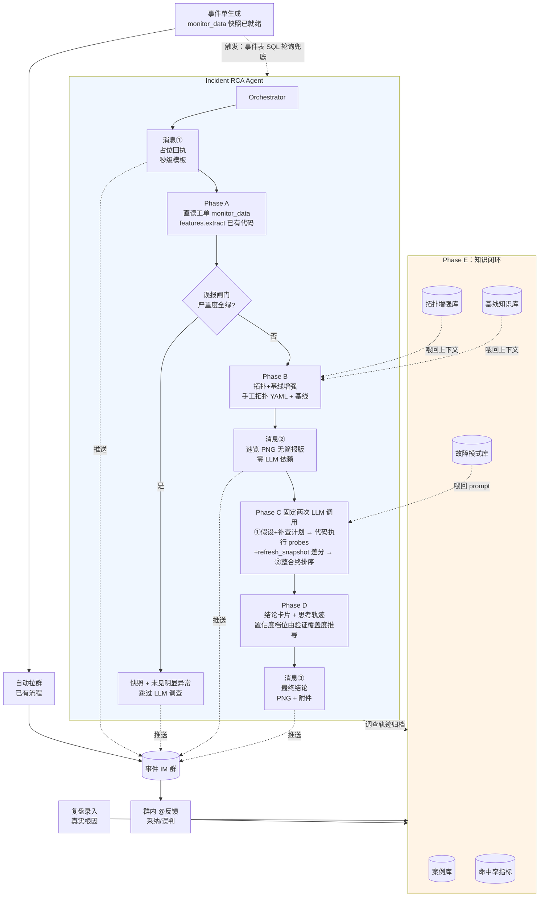

# 事件处置 Agent 落地计划

日期：2026-06-02（2026-07-05 修订）
作者：JinzeWang10
状态：草案待评审

> **2026-07-05 修订说明**：基于三项基建事实确认——① 事件单生成时 monitor_data 聚合快照（12 个监控块）已就绪，且聚合器支持按需再拉一次新快照；② 企业 IM 机器人可发图片、发文件附件、接收并解析 @；③ CMDB 拓扑接口需新申请（周期长），试点系统可先手工维护拓扑——对 V1 做了结构性修订：砍掉 3 个监控 adapter、Phase C 收敛为固定两次 LLM 调用、置信度改为代码推导的档位、新增脱敏机制与误报闸门。内网 qwen 端点对 function calling 的支持情况待验证，V1 架构不依赖它。

---

## 一、本汇报核心结论

我们计划构建一个**事件处置 Agent**：在事件单生成、自动拉群后，**Agent 作为一名"虚拟成员"入群**，自动完成现场数据采集、根因假设与验证，**把"找数据、拼时间线、形成初步假设"这段工作前置到值班同学进群前**。

- **形态**：嵌入现有"事件单触发→拉群→群内沟通"流程，**Agent 在群里以三段式消息推送调查过程与结论**，不另起工作台。
- **定位**：V1 严格"辅助分诊"，输出 Top 3 嫌疑根因 + 证据 + 思考轨迹 + 建议排查动作，**不替人下结论、不做任何写操作**。
- **路线**：V1（3 个月）→ V2（调查协同）→ V3（半自动处置），每阶段晋级以**可量化命中率**为前提。
- **关键变量**：**真正卡项目的不是技术，是跨团队接口协调、复盘数据授权、合规前置评审**——这三件事需要领导层面推动（见第八节）。其中接口协调已通过"直读工单聚合快照"从 6 项压缩到 3 项（ITSM / IM / CMDB，且 CMDB 有手工兜底不阻塞 V1）。
- **长期价值**：项目本质上不是"加一个工具"，而是搭建一套**组织运维经验的结构化沉淀机制**——Agent 是这套知识库的调用方与采集方（见第六节）。

---

## 二、终态愿景（1.5–2 年）

### 2.1 用户视角：事件群里多了一个会思考的"同事"

事件群拉起的同一秒，Agent 入群，按下面节奏推送：

```
─────────────── 事件群 INC-2026-1234 ───────────────

10:32:18  [系统] 已拉起群聊，事件单：SBYL 响应率异常

10:32:19  [🤖 RCA Agent] 加入群聊

10:32:20  [🤖 RCA Agent]
   📢 收到事件单 INC-2026-1234（系统 SBYL，影响范围"总公司"）
   我正在并行采集监控数据并展开根因调查
   预计 2-3 分钟内给出 Top 3 嫌疑根因
   ───
   调查过程将分两次推送：① 现场快照 ② 最终结论

10:32:28  [🤖 RCA Agent]
   📊 现场快照（工单聚合快照已解析，12 个监控块）
   [一张结构化速览 PNG]

   关键现象：
   • BPC：SBYL 响应率从基线 99.5% 掉至 92.3%（10:30 起）
   • 主机：18 台中 1 台告警（10.20.45.18 内存 97%）
   • 日志：12 条关键字命中，含 3 条 "connection timeout to db1"

10:33:45  @值班-张工 进群

10:35:40  [🤖 RCA Agent]
   🎯 最终调查结论
   [一张完整 RCA 卡片 PNG + 长文本附件]

   Top 1 嫌疑（置信度：高，3/3 项验证命中）：DB1 资源瓶颈 / 慢查询
   Top 2 嫌疑（置信度：低，已排除主要证据）：Redis-Cluster-A 异常
   Top 3 嫌疑（置信度：低，证据不足）：网络抖动

   详细证据链 + 思考轨迹见附件
   建议优先核查：DB1 当前长事务与慢查询（快照只见 active_conn/IOwait 越阈，库内明细需 DBA 登库确认）

10:35:55  @值班-张工：收到，先看 DB1
```

**核心设计**：
- Agent 不抢话筒，按三段式（占位 → 快照 → 结论）推送，节奏可控不刷屏
- 关键证据用 PNG 卡片承载（复用 incident 模块已有渲染），快速可读
- 思考轨迹作为附件给出，**愿意深究的人能看 Agent 怎么推的；不想看的人只看结论**
- 值班进群前就有结构化全景，**省下"自己登 N 个平台拉数据"的几分钟**

### 2.2 Agent 的四种思考能力

Agent 不是"自动拉数据的脚本"，它做的是**真正的认知工作**，对应四种能力：

| 能力 | 内涵 | 在 Agent 里如何实现 |
|------|------|------------------|
| **① 感知 (Perception)** | 不只是拉数据，是**跨源时间对齐 + 异常识别** | 多监控源并行采集 → 统一时间轴 → 用特征工程（严重度打分、越阈聚类、症状分类）识别异常信号 |
| **② 假设 (Hypothesis)** | 基于现象 + 拓扑 + 故障模式库，**生成带置信度的 Top N 候选根因** | LLM 结合拓扑上下游（V1 手工 YAML / V2 CMDB）、历史基线、已知故障模式，输出候选假设 + 各自证据；置信度档位由代码按验证覆盖度推导 |
| **③ 验证 (Verification)** | 针对每个假设，**自主决定补查哪些维度** | V1：计划-执行两段式——LLM 一次性给出 probe 补查清单，代码确定性执行（快照切片 + 二次快照差分），LLM 再整合；V2+ 视 qwen function calling 验证结果升级为开放式多轮 tool calling |
| **④ 反思 (Reflection)** | 对比验证结果，**调整假设排序或追加新假设** | 看到新数据后修正想法，不是"一次推完就走"——这是 Agent 与"自动化脚本"的本质区别 |

**这四种能力一起，构成了 Agent "像一个有经验的值班副手"的核心。**

### 2.3 完整调查思考轨迹示例

下面是 Agent 在一次真实形态事件中的**内部推理过程**（V1 输出附件会包含这段，方便人工核对它"想得对不对"）：

```
[10:32:15] 触发：事件单 INC-2026-1234（系统 SBYL，影响"总公司"）

──── Phase A: 现场快照（并行拉数据，~8 秒）────
[10:32:26] 完成工单 monitor_data 快照解析（12 个监控块），已推送速览图
  • BPC：响应率掉至 92.3%（基线 99.5%），耗时 P95 1.42s（基线 320ms，3.5 倍）
  • 主机：1 台告警（10.20.45.18 内存 97%）
  • 日志：12 条命中，3 条 "connection timeout to db1"

──── Phase B: 拓扑 + 基线增强（~2 秒）────
[10:32:28] 已加载上下文
  • SBYL 上下游（V1：试点系统手工维护的拓扑 YAML；CMDB 接口 V2 接入）：
    上游 → API-Gateway-Cluster-A
    依赖 ↓ DB1 (GaussDB), Redis-Cluster-A
  • 历史基线参考：DB1 active_conn 7 天 p90 = 65

──── Phase C: 假设驱动调查（固定两次 LLM 调用：计划 → 代码执行 → 整合）────
[10:33:50] 第 1 次调用：假设生成 + 补查计划
  🧠 观察：
     1. BPC 耗时上涨从 10:30 开始，持续型而非脉冲型
     2. 告警主机 10.20.45.18 不在 SBYL 部署列表 → 弱相关，降级
     3. 日志 "timeout to db1" 直接指向 DB1
  🧠 候选假设（已对照故障模式库匹配）：
     H1（初判：中）DB1 资源瓶颈：耗时持续 + 日志指向 + SBYL 重度依赖 DB1
     H2（初判：低）Redis 故障：SBYL 也依赖 Redis，待验证
  🔧 补查计划（probe 清单，交由代码执行）：
     db_instance_status / db_alarms / log_keyword_hits（过滤 redis）
     refresh_snapshot（间隔 2 分钟再拉一次快照做时序差分）

[10:33:52] 代码执行 probes（快照内存读，毫秒级）+ 等待二次快照
  ✅ db_instance_status：DB1 active_conn = 178（基线 p90 = 65，超 2.7 倍），IOwait 38%（越阈）
  ✅ log_keyword_hits：SBYL 应用日志无 Redis 相关报错
  ✅ refresh_snapshot 差分：BPC 耗时仍在恶化（P95 1.42s → 1.61s），非自动恢复型

[10:35:30] 第 2 次调用：证据整合 + 终排序
  🧠 假设更新：
     H1 置信度 中 → 高（3/3 项验证命中：耗时持续恶化 + 日志指向 + DB 实测越阈）
     H2 排除（应用日志无 Redis 报错）
  输出结论（置信度档位由代码按验证覆盖度推导，LLM 只给排序与理由）

──── Phase D: 输出最终结论 ────
[10:35:40] 推送结论卡片到群
```

**这段轨迹本身就是产品的一部分**——它让 Agent 的判断**可解释、可质疑、可纠正**。值班看完能说"H1 推得对"或"H2 排除得太早"。这是单纯输出"DB1 慢查询"四个字所做不到的。

### 2.4 能力维度（终态）

| 维度 | 终态 |
|------|------|
| 触发 | 事件单触发（默认）+ 告警触发 + 值班手动唤起，**多源** |
| 信息源 | 全监控栈 + CMDB + 工单 + 发布平台 + 历史案例库 + 故障模式库 |
| 调查深度 | LLM 多轮假设验证，能识别 20+ 类常见故障模式 |
| 协作 | **群内双向对话**：值班 @ Agent 追问、要求补查、给反馈 |
| 处置 | 部分场景半自动执行预案（重启/切流/扩容），**全程审批门** |
| 学习闭环 | 复盘真实根因自动回流，故障模式库持续生长 |

### 2.5 业务价值

| 指标 | 当前 | 终态目标 |
|------|------|---------|
| 首次假设根因时间（MTTI） | 值班"找数据"占大头 | 缩短 **[ ]%** |
| 值班一线"找数据"耗时占比 | ~**[60-70]%** | < 20% |
| 同类故障跨值班定位差异 | 经验依赖，差异大 | 显著收敛 |
| **运维经验沉淀方式** | 文档 + 个人脑子 + 口耳 | **结构化故障模式库 + 案例库，Agent 即调用方** |

最后一行不是文字游戏——见第六节。

---

## 三、要解决的核心难题

不是把接口接通、把 LLM 接上就能成。下面四件事**前两个是技术，后两个是组织**，必须都解决。

### 3.1 认知基础设施缺位（最致命）

LLM 默认会做的事是：看哪些数据"看起来异常"，编一个连贯的故事。要让它真正定位根因，必须**外部喂三块认知**：

| 缺什么 | 不喂会怎样 | 怎么补 |
|--------|-----------|-------|
| **拓扑/依赖知识** | Agent 不知道"系统 A 慢可能是因为 DB B 的 IO 满了" | V1：试点 1–2 系统的拓扑手工写成静态 YAML（即"拓扑增强库"，V1 阶段它就是唯一拓扑源）；V2 接 CMDB 接口后与手工版本对照，反向验证 CMDB 准确性 |
| **基线知识** | 看到"CPU 60%"不知道是高是低 | 监控源返回时附带"该指标过去 7 天 p50/p90" |
| **故障模式知识** | 不知道"发布→错误飙升""DB 长查询→应用超时"等已知模式 | 故障模式库注入 prompt 作为"优先验证假设" |

**这三块不喂，Agent 会产出 "plausible-but-wrong"——表述自洽、引用具体、看起来很专业，但根因猜错。在运维场景，自信的错误根因比没有结论更危险。**

### 3.2 接口与组织协作（曾是 70% 的实际工作量，V1 已架构性压缩）

"把接口拿过来"听起来像动词，实际是项目。每个监控/CMDB 系统都意味着：

| 子任务 | 表象 | 实际成本 |
|--------|-----|---------|
| 协议适配 | REST/JSON | 部分系统是 SOAP、内部 RPC、JDBC、定时 dump |
| 认证 | API key | SSO、服务账号申请、IP 白名单、动态令牌 |
| 字段语义对齐 | system_code 全平台一致 | BPC/CMDB/日志平台命名各异，需查 CMDB 反查 |
| 时间窗口 | start/end | 时区、开闭区间、采样粒度对不齐 |
| **跨团队权限** | 找文档 | **走流程申请、安全评审、签数据共享协议** |

最后一行通常是隐形成本最大的一项，也是这个项目最需要领导支持的地方。

**V1 的应对是"少接接口"而不是"快接接口"**：事件单生成时 monitor_data 聚合快照（含 BPC/主机/DB/组件/日志关键字等 12 个监控块）已写在工单上，且聚合器支持按需再拉——因此 V1 **不新建任何监控 adapter**，Phase A 退化为"读工单一行 + `features.extract()`"（代码已存在并经真实数据验证）。BPC、主机监控、日志平台三个团队的接口协调整体消失，剩余协调面只有 ITSM（读事件单，可 SQL 直连兜底）、企业 IM（能力已确认）、CMDB（手工拓扑兜底，不阻塞）。

### 3.3 评估与反馈闭环

如果不知道 Agent 的根因判断是对是错，几次错判后值班就不再信它，项目自然死。

**对策**：从第一天就建一条最小闭环：
- 每次复盘录入"实际根因"（5 字段表：事件 ID、根因系统、根因类型、复盘人、备注）
- Agent 的输出存档，定期跑命中率统计
- 群里值班的 @反馈（"采纳"/"误判"）入库
- 错判 case 反喂去更新故障模式库

**"命中"必须现在就定义成机器可判的匹配函数**，否则命中率数字会变成口径扯皮：命中 = Top 3 中存在某假设，其"根因类别"与真实根因类别一致 **且** "定位对象"归一化后一致。真实根因的 ground truth 直接复用知识蒸馏管线 Stage 1 产出的 `Case`（结构化回填：类别/定位对象），历史回放与试点期共用同一套判定。注意：回放取数必须 SQL 直连——xlsx 导出会把超长 monitor_data 截断在 32767 字符。

**这条闭环也是第六章"知识沉淀"的核心数据源。**

### 3.4 合规与权限

监管行业里 AI 介入事件处置有红线：

- 操作必须**全程审计可追溯**
- 客户/敏感数据流过 Agent 时需**脱敏**——不是一句口号，V1 有具体机制：日志关键字命中的原始 message 会同时进 LLM prompt 和群消息，保险业务日志可能含保单号/证件号/客户姓名，因此在 `to_llm_brief()` 层加一道**确定性脱敏 pass**（正则掩码手机号/证件号/保单号等），列入 M1 交付。合规评审必问此项，M1 做好比 M3 被卡强
- **写操作必须有人工审批门**
- V1 严格只读，避开这条红线；V2/V3 写动作上线前需先过合规评审

---

## 四、整体路线图

| 阶段 | 时间 | 定位 | 关键能力 | 风险 | 晋级条件 |
|------|-----|------|---------|------|---------|
| **V1** | 0–3 月 | **分诊辅助**（Triage） | 群内三段式推送、Top 3 嫌疑 + 思考轨迹、聚合快照直读（12 监控块）+ 二次快照差分 + 手工拓扑 | 低（只读） | 内部试点 |
| **V2** | 4–9 月 | **调查协同**（Co-pilot） | 群内双向对话、@追问、按需实时查询接口（按 V1 命中率短板逐个申请）、CMDB 接入、开放式多轮调查（以 qwen tools 验证为前提） | 中（消费面扩大） | V1 命中率 ≥ [目标值] |
| **V3** | 10–24 月 | **半自动处置**（Semi-auto） | 预案触发执行（重启/切流/限流），全程审批门 | 高（写操作） | 合规评审 + 业务团队联签 |

**不"猛冲终态"。每阶段晋级以上一阶段可量化命中率为前提。**

---

## 五、V1 详细方案

### 5.1 V1 目标与范围

**做什么：**
- 事件单触发拉群时，Agent 自动入群（触发以事件表 SQL 轮询兜底，不被 ITSM 回调申请卡住）
- **三段式 discrete 群消息**：占位回执 → 现场快照（PNG，无 LLM 依赖）→ 最终结论卡片（含 Top 3 嫌疑 + 完整思考轨迹）
- **直读工单 monitor_data 聚合快照（12 个监控块，不新建监控 adapter）+ 按需二次快照（refresh_snapshot 时序差分）+ 手工拓扑 YAML + 历史复盘库**
- **误报闸门**：快照严重度全绿 → 只推快照 +"未见明显异常信号"，跳过 LLM 调查
- **群内 @ 反馈入口**（采纳/误判，固定命令词），数据回流知识库，同步落根因登记表双通道防漏

**不做什么：**
- ❌ 不做任何写操作（不重启、不切流、不改配置）
- ❌ 不替代值班决策（不下"最终根因"结论）
- ❌ 不新建任何监控源 adapter（快照已含 12 个监控块；按需实时查询接口留给 V2 按命中率短板逐个申请）
- ❌ 不做对话式交互（V1 单向推送，V2 才支持 @追问）
- ❌ 不做开放式多轮 tool loop（V1 固定两次 LLM 调用；qwen function calling 验证通过后 V2 再评估）

**为什么 V1 这么收：** 用最小可行规模啃下第三节四个难题。规模过大，9 个月还在调接口；规模到位，3 个月能拿到真实命中率数据。

### 5.2 V1 系统架构



### 5.3 V1 关键设计决策

每一条都是踩过坑的，不是任选的。

| 决策 | 为什么 |
|------|--------|
| **嵌入"事件单→拉群"现有流程，Agent 入群推送** | 不另起工作台；值班不用切上下文；事件群是天然的"调查工作面"和"反馈通道" |
| **三段式 discrete 消息（占位 + 快照 + 结论）** | IM 接口不支持流式；分段推送让"Agent 在动"可感知；快照在 LLM 跑完前就给到，值班能并行准备 |
| **直读工单 monitor_data 快照，不新建任何监控 adapter** | 事件单生成时快照（12 个监控块）已就绪；`features.extract()` 已有且经真实数据验证；BPC/主机/日志三个团队的接口协调整体消失——接口稀缺的解法是"少接接口" |
| **refresh_snapshot（按需二次快照差分）是 V1 唯一带新信息的验证工具** | 聚合器支持按需再拉；静态快照上的多轮推理只是换角度看同一份数据，两份快照的时序差分（恶化/持平/已恢复）才是真正的新证据，且零新接口成本，顺带支撑自动恢复/误报判定 |
| **Phase C 固定两次 LLM 调用（计划 → 代码执行 → 整合），不做开放式 tool loop** | 内网 LLM 80s/次，开放式循环 3–4 轮即击穿 5 分钟 P95；除 refresh_snapshot 外全部 probe 是内存读（毫秒级），不值得为其付 80 秒决策成本；qwen 原生 function calling 未验证，约束 JSON 是保底路线（pull_agent 已验证）；probe 执行清单天然满足审计留痕，每次调查成本可预算 |
| **触发器是事件单（兼容现状），事件表 SQL 轮询兜底，内部为告警留接口** | 事件表可 SQL 直连（example.sql 已验证），不被 ITSM 回调接口申请卡住；代价是占位消息时效放宽到轮询间隔；V2 可扩展告警直接触发 |
| **输出 Top 3 嫌疑而非"最终根因"** | 第一版命中率达不到能让人闭眼信的水平；Top 3 + 证据链是诚实形态 |
| **置信度用高/中/低档位，由代码按验证覆盖度推导，不用 LLM 给的百分比** | LLM 给的百分比不可校准，"82%"是伪精度，监管行业里还是审计隐患；pattern 声明的验证 probe 中被实际执行且判定命中的覆盖度决定档位——"覆盖度核对归代码、内容认知归 LLM"与 knowledge/schema.py 的设计哲学一致 |
| **"思考轨迹外显"作为附件给出** | 让 Agent 的判断**可解释、可质疑、可纠正**；汇报与日常都体现"它真的在想"（IM 机器人发文件附件能力已确认） |
| **V1 拓扑用试点系统手工 YAML，CMDB 接口 V2 接入** | CMDB 接口需新申请周期长；试点 1–2 系统手工梳理约一天工作量；拓扑是事实，LLM 推理会幻觉，事实当上下文喂；V2 接口上线后与手工版对照可反向验证 CMDB 准确性 |
| **误报闸门：快照严重度全绿 → 跳过 LLM 调查** | 误报压制要有机制而不只是验收条款；省 LLM 配额、防刷屏，顺带覆盖历史数据中 is_invalid 类事件 |
| **消息②渲染"无简报版"PNG，LLM 简报并入消息③** | 当前 dashboard PNG 内嵌的现象简报是 LLM 生成（80s），与"快照 15 秒不依赖 LLM"的验收冲突；模板已支持区块整块消失，改动很小 |
| **脱敏 pass 在 to_llm_brief() 层，M1 落地** | 日志关键字原始 message 同时进 LLM prompt 和群消息，可能含保单号/证件号/客户姓名；确定性正则掩码，合规评审必问项 |
| **故障模式库手工初始化 10–20 条** | V1 不上 RAG 不上向量库，纯 prompt 静态注入；验证模式有效再考虑动态检索 |
| **Phase E（知识闭环）第一天就上** | 没有评估数据，项目内部都说服不了自己；优先级高于 Phase B/C |
| **不为内网 LLM 慢（80s/次）改消息形态** | 三段式消息形态已经消解了感知延迟；首条占位、快照 15 秒内、结论分钟级；Phase C 锁死两次调用后端到端延迟可控在 ~3 分钟 |

### 5.4 实施计划（3 个月分解）

| 月份 | 里程碑 | 关键交付 |
|------|--------|---------|
| **M1** | 数据链路与基础就绪 | • 工单 monitor_data 直读链路（SQL 直连，含事件表轮询触发）<br>• 聚合器按需二次快照调用打通（refresh_snapshot）<br>• 试点系统手工拓扑 YAML（1–2 系统）<br>• IM 机器人入群+发图/发附件（复用 pull_agent 通道扩展）<br>• 脱敏 pass 落地（`to_llm_brief()` 层正则掩码）<br>• 历史复盘库批量导出确认<br>• 审计日志框架落地<br>• **qwen 端点 function calling 支持验证**（结论只影响 V2 是否上开放式循环，V1 架构不依赖） |
| **M2** | Agent 主流程贯通 + 历史回放评估 | • Phase B（拓扑+基线增强）实现<br>• Phase C 两段式实现（假设+补查计划 → 代码执行 probes → 整合终排序，约束 JSON 输出，思考轨迹外显）<br>• 误报闸门 + 置信度档位推导（按验证覆盖度）<br>• 故障模式库手工写出 10–15 条（复用知识蒸馏管线产出的候选 Pattern 人审入库）<br>• Phase D 三段式群消息推送链路打通（消息②无简报版 PNG）<br>• **在 10–20 个历史事件上回放**（数据 SQL 直连取 monitor_data，ground truth 用知识管线 Stage 1 Case，命中按机器可判匹配函数），得到首版命中率数字 |
| **M3** | 试点上线 + 知识闭环 | • 群内"@采纳/@误判"反馈入口落地（固定命令词，同步落根因登记表双通道）<br>• 复盘录入工具 + 命中率/采纳率 dashboard<br>• 案例库自动归档（每次调查的完整 trace）<br>• **小范围试点**：选 1–2 个系统的事件单先跑，与值班实时对照 |

### 5.5 V1 验收标准

| 维度 | 标准（建议值，需内部口径确认） |
|------|---------------------------|
| **历史回放命中率** | Top 3 嫌疑命中真实根因 ≥ **[60–70]%**（命中 = 机器可判匹配函数：根因类别一致且定位对象归一后一致，ground truth 为知识管线 Stage 1 Case） |
| **群内试点采纳率** | 值班 @ 采纳占比 ≥ **[50]%** |
| **时效（首条响应）** | 占位消息 ≤ **30 秒**（P95，纯模板；含事件表 SQL 轮询间隔） |
| **时效（快照推送）** | 速览 PNG ≤ **15 秒**（P95，无简报版渲染，零 LLM 依赖） |
| **时效（端到端）** | 最终结论 ≤ **5 分钟**（P95；Phase C 锁死两次 LLM 调用，2×80s + 渲染，正常路径 ~3 分钟） |
| 覆盖事件类型 | ≥ **3 类**（DB 慢查询、发布相关、网络抖动等） |
| 误报压制 | 监控全绿系统不产生干扰输出（机制：Phase C 前的确定性严重度闸门，非事后人工把关） |
| 敏感数据 | 群消息与 LLM prompt 中的日志原文经脱敏 pass，抽检零泄漏 |
| 可观测 | 命中率/采纳率/覆盖率有 dashboard；每次调查的完整 prompt + probe 执行清单可追溯 |
| **知识沉淀** | 案例库累积 ≥ **[30]** 条；故障模式库新增 ≥ **[3]** 条（来自试点中涌现的新模式） |

**达标 → V2 启动评审。不达标 → 区分是认知基础设施问题（补 prompt/模式库）还是数据质量问题（修接口），决定返工还是收敛。**

### 5.6 资源与依赖

| 项 | V1 需求 |
|----|--------|
| **人力** | **[X]** 人月（1 名工程开发 + 0.3 SRE 配合 + 0.2 产品/复盘联络） |
| **LLM 算力** | 复用现有内网 qwen 端点，预估月调用量 **[Y]** 万次（含历史回放） |
| **存储** | 复盘库 + 审计日志 + 案例库 + 命中率指标，**[Z]** GB/月（可复用现有 ELK/OLAP） |
| **跨团队依赖** | 见第八节 |

---

## 六、知识沉淀机制

**这一节是这个项目最值得讲透的部分。** 它回答一个问题：**这个项目除了"做一个工具"，长期给组织留下了什么？**

### 6.1 我们沉淀什么——四类知识

| 知识类型 | 内容 | 来源 | 用法 |
|---------|------|------|------|
| **① 故障模式库**<br>(Failure Patterns) | 三元组：现象 → 候选原因 → 验证方法<br>例："BPC 耗时持续上涨 + 强 DB 依赖 → 怀疑 DB 慢查询，验证：active_conn + 长事务" | V1：人工从历史复盘蒸馏<br>V3：Agent 自动建议，人审入库 | 注入 Phase C prompt 作为"优先验证假设" |
| **② 案例库**<br>(Historical Cases) | 每次完整事件：现象 + 调查轨迹 + 真实根因 + 处置 | Agent 自动归档 + 复盘人补充真实根因 | V1：人工 reviewer + 周度回顾<br>V2+：RAG 检索，新事件查相似历史 |
| **③ 拓扑增强库**<br>(Topology Augmentation) | 靠经验维护的依赖关系；**V1 阶段它就是唯一拓扑源**（试点系统手工 YAML），V2 起降级为 CMDB 的经验补充层<br>例："系统 A 实际还依赖中间件 B，CMDB 未录" | V1 试点前人工梳理；此后每次发现 CMDB 不准时人工补 | Phase B 拓扑加载时注入 prompt |
| **④ 基线知识库**<br>(Per-System Baselines) | 每系统每指标的"常态"统计<br>例："SBYL 工作日 9-11 点 BPC 耗时正常 300-400ms" | 历史指标数据自动算 + 人工修订（促销/营销期等） | Phase B 注入上下文，LLM 用基线判断异常 |

### 6.2 闭环：输入 → 处理 → 输出

```
            ┌─────────────────┐
            │   输入（来源）   │
            ├─────────────────┤
            │ • 复盘真实根因  │
            │ • 群内 @反馈    │
            │ • Agent 调查轨迹 │
            │ • CMDB 不准情况 │
            └────────┬────────┘
                     ↓
            ┌─────────────────┐
            │  处理（沉淀）    │
            ├─────────────────┤
            │ V1: 人工录入+审  │
            │ V2: 半自动建议   │
            │ V3: Agent 提案   │
            └────────┬────────┘
                     ↓
       ┌─────────────────────────┐
       │      四类知识库          │
       │ 故障模式/案例/拓扑/基线  │
       └────────────┬────────────┘
                    ↓
       ┌─────────────────────────┐
       │    输出（被 Agent 调用）  │
       ├─────────────────────────┤
       │ • Phase B 注入上下文     │
       │ • Phase C 注入 prompt    │
       │ • V2+ RAG 检索           │
       │ • V3 自动预案匹配        │
       └─────────────────────────┘
```

### 6.3 Agent 是组织运维经验的"活载体"

**这是项目最核心的长期价值，也是和"做一个工具"最本质的区别。**

| 过去（无 Agent） | 现在（有 Agent + 知识沉淀） |
|----------------|--------------------------|
| 老值班的判断模式沉在他自己脑子里 | 通过故障模式库结构化沉下来 |
| 新人接班从零积累经验 | 接班即获得集体经验（Agent 调用知识库） |
| 故障复盘文档"写完就放着" | 真实根因回流喂养知识库 |
| 同一类故障，不同值班定位差异巨大 | Agent 输出收敛，跨值班质量趋同 |
| 经验断层风险（老员工离职即失传） | 经验外化为组织资产 |

**Agent 越用，知识库越厚；知识库越厚，Agent 越准。这是项目的"长期复利"。**

### 6.4 V1/V2/V3 各沉淀什么

| 阶段 | 故障模式库 | 案例库 | 拓扑增强库 | 基线库 |
|------|-----------|--------|-----------|--------|
| **V1** | 人工初始化 10–15 条（知识蒸馏管线候选 + 人审）<br>试点中涌现新模式 ≥ 3 条 | Agent 自动归档全部调查轨迹（≥ 30 条）+ 存量工单批量导入 | 手工维护试点系统拓扑 YAML（V1 唯一拓扑源） | 从历史工单快照与历史指标算核心监控块基线 |
| **V2** | 总数 ≥ 30 条；半自动建议入库 | RAG 化，新调查可检索历史相似案例 | 推动 CMDB 团队修正源头 | 全监控源基线覆盖 |
| **V3** | Agent 自动从案例提取候选模式，人工审核 | 跨事件聚类，发现共性根因 | 与 CMDB 双向同步 | 动态基线（按时段/业务周期） |

### 6.5 V1 知识闭环的具体落地

不要把"知识沉淀"做成宏大叙事——V1 三件具体动作：

1. **建一张"事件根因登记表"**（5 字段：事件 ID、根因系统、根因类型、复盘人、备注），复盘后由复盘人填，10 分钟可完成。
2. **手工写 10–15 条故障模式 Markdown 文件**（每条 200 字以内：现象/原因/验证），放进 prompt 上下文。
3. **每月一次"模式库回顾会"**（30 分钟）：值班代表 + 复盘人 + Agent 项目组三方，看本月 Agent 表现，决定新增/修订哪些模式。

**不需要复杂工具，但要从第一天就开始做。半年下来这套机制本身就是公司的运维资产。**

---

## 七、风险与应对

| 风险 | 影响 | 应对 |
|------|------|------|
| 剩余跨团队接口（ITSM/IM/CMDB）拿不下来 / 周期失控 | M1 拖期 | 协调面已从 6 项压到 3 项：监控三源靠直读快照消除；ITSM 有事件表 SQL 直连兜底；CMDB 有手工拓扑兜底；真正无兜底的只剩 IM 机器人账号（能力已确认，仅剩申请流程），第八节请领导重点保它 |
| qwen 端点 function calling 不支持/不稳定 | Phase C 实现路线 | 不构成 V1 风险：两段式用约束 JSON 即可实现（pull_agent 已验证解析路线）；M1 验证结论只决定 V2 是否上开放式循环 |
| 命中率达不到 60% | V1 验收不过 | 区分是认知基础设施问题（补 prompt/故障模式库）还是数据质量问题（修快照字段/拓扑）；命中匹配函数已提前定义，排除口径争议 |
| 复盘数据质量差 / 拿不到 | 评估闭环失效 | 第八节请领导协调；知识蒸馏管线已能从存量工单批量萃取结构化根因；最坏转人工标注（1 人天/10 事件） |
| LLM 幻觉根因导致误导值班 | 信任崩塌 | V1 严格 Top 3 + 证据链 + 思考轨迹形态；置信度档位由代码按验证覆盖度推导，LLM 无法自报高置信；明确标"AI 辅助分析，请人工核实"；每条 @误判反馈直接进入 prompt 改进循环 |
| 聚合器快照缺块/接口失败 | Agent 经常半失败 | `FeatureBag` 四态设计（present/empty/interface_failed/absent）已内建"单源失败不阻断"；输出明确标注哪些信号不可用 |
| 敏感信息经群消息/LLM 外泄 | 合规红线 | `to_llm_brief()` 层确定性脱敏 pass（M1 交付）+ 试点期人工抽检 |
| **内网 LLM 速度（80s/次）影响体验** | 端到端时间长 | 三段式消息消解感知延迟；Phase C 锁死两次调用，端到端 ~3 分钟可控；不为此改消息形态 |
| 合规评审卡住试点 | M3 上不了线 | M1 末同步提交合规材料（含脱敏机制说明）；试点严格限定 1–2 系统作为"沙箱" |
| 群消息节奏被嫌刷屏 | 用户体验差 | 三段式上限封死；误报闸门砍掉全绿事件的调查消息；快照消息可由配置关闭；试点期收集反馈调节奏 |

---

## 八、需要领导支持的事项

**技术之外，下面四件事只有领导能推动，是项目能否按期落地的真正变量。**

### 8.1 跨团队接口协调（最关键）

需要协调的团队已通过"直读工单聚合快照"从 6 个压缩到 3 个（BPC/主机监控/日志平台不再需要单独对接——快照里已经有）：

| 系统 | 需要的支持 | 兜底方案 | 预估周期 |
|------|----------|---------|---------|
| ITSM/事件单 | 事件单读（monitor_data 字段）+ 评论写权限 + 聚合器按需二次快照调用 | 事件表 SQL 直连轮询（example.sql 已验证可行） | **[ ]** 周 |
| 企业 IM | 机器人账号 + 入群 + 发图/发附件 + @ 解析（能力已确认具备，复用 pull_agent 通道扩展） | 无兜底，**最优先协调项** | **[ ]** 周 |
| CMDB | 拓扑/依赖查询接口、字段语义对齐（**V2 需求，V1 不阻塞**） | 试点系统拓扑手工 YAML（约 1 天工作量） | **[ ]** 周 |

**请领导支持**：发起跨中心/部门协调，明确接口提供方对接人和 SLA；其中企业 IM 机器人账号是 V1 唯一无兜底的硬依赖。

### 8.2 历史复盘数据授权

请协调过去 **[6–12]** 个月事件复盘文档（含真实根因）的**批量导出权限**。这是评估闭环和故障模式库初始化的口粮。

### 8.3 合规与安全评审前置启动

请协调安全/合规团队在 M1 同步介入，提前明确：
- AI 输出在事件处置中的角色边界（"辅助"vs"建议"vs"决策"的合规定义）
- 审计日志的留存与提交要求
- 试点上线的批准路径

### 8.4 试点系统选型背书

V1 试点需要选 1–2 个业务系统先跑。请领导参与确定试点范围，并向被试系统的业务/运维团队预先沟通定位（**辅助工具，不是替代决策**），降低试点阻力。

---

## 九、后续节奏

| 时间 | 动作 |
|------|------|
| 本汇报后 1 周内 | 收集反馈，定稿 V1 详细设计 |
| M0 启动会 | 跨团队对齐，明确接口对接人 |
| M1/M2 末 | 内部进度同步 + 风险通报 |
| M3 末 | V1 验收 + V2 立项评审 |

---

## 附：本方案与现有积累的关系

V1 不是从零起步，是在现有积累上的演进：

- `big_data_model/incident/` 已完成"现场快照"层（FeatureBag 特征提取 + 四态缺失处理 + 受约束 LLM 简报 + PNG 渲染），**直接作为 V1 的 Phase A + 消息②的 PNG 来源**（消息②用无简报版渲染）
- `big_data_model/incident/knowledge/` 已完成故障模式 schema（`Pattern`/`Verification`，probe 名机器可校验）、probe 注册表（12 个快照切片探测）与案例库 `CaseStore`，**直接作为 Phase C 的模式注入与 Phase E 的存储层**
- `big_data_model/knowledge_pipeline/` 已完成存量工单批量蒸馏管线（Stage 1 行→Case、Stage 2 案例→候选 Pattern），**作为知识库冷启动灌注与历史回放 ground truth 的来源**
- `big_data_model/pull_agent/` 的 IM 接入 + 约束 JSON 解析能力，**复用并扩展**为 V1 的"机器人入群发消息"通道与 Phase C 的 LLM 输出解析路线

**V1 主要新增量集中在五块**：工单直读+轮询触发+二次快照链路（M1）、拓扑+基线增强（Phase B）、Phase C 两段式调查（计划→执行→整合，含误报闸门与置信度档位推导）、群内三段式推送链路（Phase D）、**知识闭环 Phase E（含 4 类知识库初始化）**。
